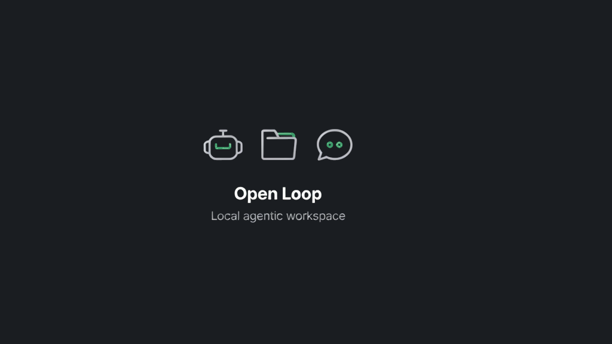

# Open Loop

A **local** web mini-app for agentic workspaces: pick a folder, describe a goal, and let an agent work on your files. Chat, file tree, and live activity in one UI.

It uses Cursor’s agent runtime via the npm package `@cursor/sdk` (third-party dependency).

## Banner



Dark banner for docs and GitHub **Social preview** (`Settings → General → Social preview`). Asset: `assets/open-loop-banner.png` (1024×576). Demo thumbnail for YouTube / video covers: `assets/open-loop-demo-thumbnail.png` (1280×720). Product demo clip: `assets/videos/open-loop-demo-15s.mp4` (15s, 720p, with audio).

> **Not affiliated with Cursor / Anysphere or Anthropic.** Independent, unofficial project. “Cursor” and “Claude Cowork” are trademarks of their respective owners. **Open Loop** is not Claude Cowork. Use of the SDK and APIs is subject to Cursor’s [Terms of Service](https://cursor.com/terms-of-service). Each user provides their **own** `CURSOR_API_KEY`.

## Quick Start

**~4–8 min first run** (mostly `pnpm install`). You need [Node.js](https://nodejs.org/) ≥ 22.13, [pnpm](https://pnpm.io) 9+, and a [Cursor API key](https://cursor.com/dashboard/integrations).

```bash
git clone https://github.com/fedollo/open-cowork.git && cd open-cowork
cp .env.example .env   # add CURSOR_API_KEY=your_key inside .env
corepack enable && pnpm install   # first install: ~2–4 min
pnpm dev                          # wait for API + Vite lines (see below)
```

Open http://localhost:5173 once both startup lines appear (`Open Loop API on http://localhost:8787` and `Local: http://localhost:5173`). Optional check:

```bash
curl http://localhost:8787/health   # expect "ok":true and "hasApiKey":true
```

**Success looks like this:**

```
Terminal                          Browser (localhost:5173)
─────────────────────────         ┌──────────┬─────────────┬──────────┐
Open Loop API on :8787  ✓       │ sidebar  │ empty chat  │ File     │
VITE ready on :5173       ✓       │ (folder, │ “Pick a…”   │ Activity │
                                  │ sessions)│             │          │
                                  └──────────┴─────────────┴──────────┘
```

The UI loads without an API key, but agent sessions fail until `CURSOR_API_KEY` is set and you restart `pnpm dev`.

**Dev server management** (macOS/Linux — uses `lsof`):

```bash
pnpm restart   # kill ports 8787/5173, then restart
pnpm stop      # kill only
```

On Windows, kill processes on ports 8787 and 5173 manually. Step-by-step setup notes: [docs/setup.md](docs/setup.md).

## Usage

With `pnpm dev` running, open **http://localhost:5173**.

Layout: **sidebar** (workspace + sessions) · **center** (chat) · **right** (**File** + **Activity**).

### First run

1. Under **Folder (absolute path)**, type an absolute folder path (e.g. `/Users/you/my-project`).
2. Set **Model** if needed (default `composer-2.5`).
3. Pick a **Template** or write a **Quality bar** — click **Use example** to pre-fill.
4. Optionally enable **Integrations** (GitHub, Atlas Cloud, Replicate) — each needs its env key in `.env` (badge shows **ready** or **needs …**).
5. Click **New session** → the **composer** appears at the bottom of the center column.
6. Write your goal, then **Start Gauntlet** (or ⌘/Ctrl+Enter).

> Before step 5 the center panel is an empty state — no goal input until you create a session.

### During a session

Follow-up messages in the composer · **Stop** cancels an active stream · edit **Quality bar** / **Boundary (optional)** before each send · toggle **Integrations** before create or on later sends (MCP config is re-applied each turn).

### Resume

Reload → select session in sidebar → send a new message. After an API restart, agent context may be fresh but local history is kept.

Session files: `.open-loop/sessions/` (gitignored). Gauntlet may write `.open-loop/gauntlet-progress.md` in the workspace.

## Gauntlet loop

Builder vs harsh critic loop ([Gauntlet Loop](https://somethingbig.ai/gauntlet-loop)). Every session requires a **concrete quality bar**. The lead agent decomposes work, fans out builder/critic subagents, and loops until the bar is met. The **Gauntlet** panel shows phase timeline, bar status, and structured progress. See [Usage](#usage) for UI steps.

## Integrations

Optional MCP servers attached to a session. Enable toggles in the sidebar; keys live only in root `.env` (see `.env.example`).

| Integration | Env key(s) | Transport |
|-------------|------------|-----------|
| **GitHub** | `GITHUB_TOKEN` or `GITHUB_PERSONAL_ACCESS_TOKEN` | HTTP → `https://api.githubcopilot.com/mcp/` |
| **Atlas Cloud** | `ATLASCLOUD_API_KEY` | stdio `npx -y atlascloud-mcp` |
| **Replicate** | `REPLICATE_API_TOKEN` | stdio `npx -y replicate-mcp` |

**GitHub token:** create a Personal Access Token at [github.com/settings/tokens](https://github.com/settings/tokens). Classic PATs (`ghp_…`) get automatic MCP tool filtering by scope; fine-grained PATs work too (API enforces permissions). Start with the least privilege you need (often `repo` + `read:org` for classic).

**Atlas Cloud:** only `ATLASCLOUD_API_KEY` is used by MCP. A chat `baseURL` like `https://api.atlascloud.ai/v1` is for OpenAI-compatible SDK clients, not for this toggle.

Enabling an integration without its key returns **400** with a clear message. Restart the API after editing `.env`. Stdio integrations need `npx` available on the machine that runs `apps/api`.

## Architecture

| Package | Role |
|---------|------|
| `apps/web` | Vite + React UI |
| `apps/api` | Hono + `@cursor/sdk` |
| `packages/shared` | Shared types |

## Roadmap

Post-MVP work — diff review, Gauntlet live board, session export, folder picker, presets, checkpoints — is tracked in [docs/ROADMAP.md](docs/ROADMAP.md). Contributions welcome.

## MVP limitations

Absolute folder path (no picker) · local agents only · no auth/multi-tenant · one lead agent per session.

## Tests

```bash
pnpm test   # unit + i18n + API smoke (if localhost:8787 is up)
```

## Troubleshooting

- **`CURSOR_API_KEY not set` / 500 on create** → Set key in root `.env`, restart `pnpm dev`. Check `curl localhost:8787/health` → `"hasApiKey":true`.
- **Port in use (8787/5173)** → `pnpm stop` or `pnpm restart`.
- **UI up, API calls fail** → Wait for `Open Loop API on http://localhost:8787` before opening the UI; `pnpm dev` must run both API and web.
- **Empty file tree** → Path must be **absolute** and exist.
- **Start Gauntlet greyed out** → Fill **Quality bar** and goal.
- **Integration requires … in .env** → Add the key from the error / badge, restart API (`pnpm restart`), then retry.
- **Session stuck `running` after crash** → `pnpm restart`, reload, select session, send again.

## License

MIT — see [LICENSE](LICENSE). `@cursor/sdk` is proprietary to Anysphere.
