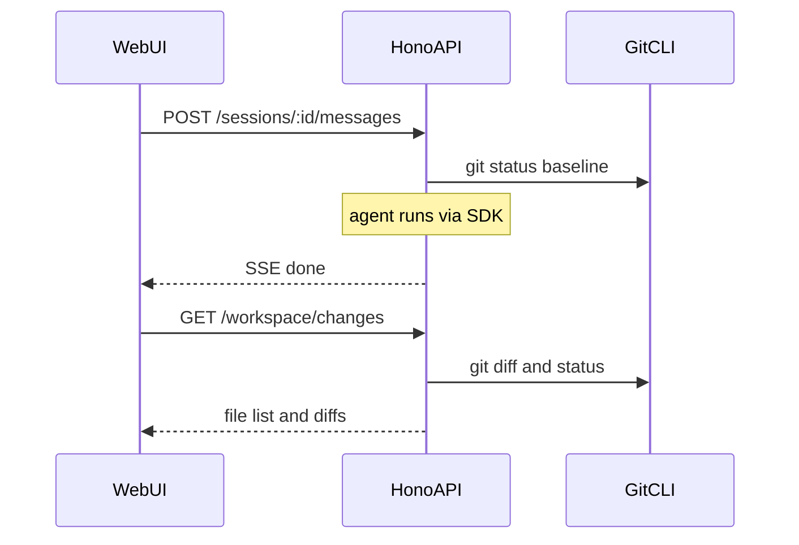

# Roadmap

Open Loop is a **local agentic workspace**: pick a folder, describe a goal, let an agent work on your files, then review the result. This document tracks what ships after the v0.1 MVP and how to contribute.

> **Naming:** Formerly scaffolded as "Open Cowork". Renamed to **Open Loop** to avoid confusion with Anthropic's [Claude Cowork](https://www.anthropic.com/product/claude-cowork). Not affiliated with Anthropic or Cursor / Anysphere.

## Vision

Complete the loop:

**pick folder → describe goal → agent works → review changes → iterate safely**

The MVP proves the core session + stream experience. Post-MVP work focuses on **review**, **comfort**, and **safety** — not dashboards, cloud hosting, or auth.

## Current state (v0.1)

What works today:

- **3-column UI**: sidebar (workspace + sessions) · center (chat) · right (file tree + activity)
- **Normal mode**: multi-turn chat with Cursor Agent SDK (`local: { cwd }`)
- **Gauntlet mode**: builder vs harsh critic loop with quality bar and optional boundary
- **Integrations**: optional MCP toggles (GitHub, Atlas Cloud, Replicate)
- **Session persistence**: `.open-loop/sessions/` on disk; resume after reload
- **Live stream**: SSE events for assistant text, tool calls, Gauntlet phases

Known MVP limits:

- Folder path must be typed manually (absolute path, no picker)
- Session diff & review tab (Changes) — v0.2
- No checkpoint / rollback
- Session export (markdown download) — v0.2
- Gauntlet progress file exists on disk but is not shown in the UI
- Local agents only; no multi-tenant or user auth

## Release overview

| Release | Theme | Features | Status |
|---------|-------|----------|--------|
| **v0.2** | Review | Session diff, Gauntlet live board, session export | Planned |
| **v0.3** | Comfort | Folder picker, workspace presets, quality bar library | Planned |
| **v0.4** | Safety | Checkpoints & rollback, rules & context inspector | Planned |

Dates are indicative — this is an OSS project with no fixed deadlines. Features may ship incrementally (e.g. 0.2.0, 0.2.1).

Suggested GitHub labels: `roadmap:v0.2`, `roadmap:v0.3`, `roadmap:v0.4`.

---

## v0.2 — Review

Theme: close the gap between *what the agent did* and *what changed in your repo*.

### 1. Session Diff & Review (flagship)

- [x] **Shipped** (v0.2)

**Problem:** Users see tool activity in the Activity panel but cannot review file changes in a structured way before committing or sending follow-ups.

**Solution:** A **Changes** tab in the right panel listing modified, added, and deleted files with unified diffs.

**Scope:**

| Layer | Work |
|-------|------|
| API | `GET /workspace/changes?cwd=&baseline=<optional>` → file list with git status codes |
| API | `GET /workspace/diff?cwd=&path=` → unified diff for one file |
| Logic | Use `git status` / `git diff` when `cwd` is a git repo; graceful empty state when not |
| API | Capture baseline snapshot at message send start; UI refreshes on SSE `done` |
| Shared | Types: `FileChange`, `WorkspaceChangesResponse` in `packages/shared` |
| UI | **Changes** tab alongside File / Activity in `apps/web` |

**Out of scope:** staging, commit, merge conflict resolution from the UI.

**Acceptance criteria:**

- After a run that edits files, the Changes tab lists all touched files grouped by status.
- Clicking a file shows a readable unified diff.
- Non-git workspaces show a clear empty state, not a 500 error.

---

### 2. Gauntlet Live Board

- [x] **Shipped** (v0.2)

**Problem:** Gauntlet mode instructs the agent to maintain `.open-loop/gauntlet-progress.md`, but the UI never displays it.

**Solution:** A **Gauntlet** tab (visible when `session.mode === 'gauntlet'`) that renders the progress file as markdown and shows the current phase.

**Scope:**

| Layer | Work |
|-------|------|
| API | `GET /workspace/file?cwd=&path=.open-loop/gauntlet-progress.md` (or extend existing fs routes) |
| UI | Markdown render; refresh on `gauntlet_phase` SSE events |
| UI | Phase badge: `lead` · `build` · `critique` · `integrate` (types already in `packages/shared`) |

**Acceptance criteria:**

- Progress file content updates during a Gauntlet run without a full page reload.
- Phase badge matches the latest `gauntlet_phase` stream event.

---

### 3. Session Export

- [x] **Shipped** (v0.2)

**Problem:** No portable artifact for GitHub issues, PR descriptions, or handoff to another developer.

**Solution:** Download session as markdown.

**Scope:**

| Layer | Work |
|-------|------|
| API | `GET /sessions/:id/export` → `text/markdown` attachment |
| Content | Goal, mode, quality bar, boundary, transcript, activity summary, changed files (when Diff API exists) |
| UI | **Export** button on active session (header or sidebar) |

**Acceptance criteria:**

- Export includes all messages and session metadata.
- Works for both Normal and Gauntlet sessions.

---

## v0.3 — Comfort

Theme: reduce friction for repeat use and Gauntlet setup.

### 4. Folder Picker + Recent Folders

- [ ] **Not started**

**Problem:** Users must copy-paste absolute paths manually.

**Solution:** Native folder picker + list of recently used folders.

**Scope:**

| Layer | Work |
|-------|------|
| API | `POST /fs/pick` — native dialog (document macOS / Linux / Windows support) |
| Storage | `.open-loop/recents.json` (local, gitignored), max 10 entries |
| UI | **Browse** button next to folder input; recent paths dropdown |

**Out of scope:** Electron packaging, remote/cloud folders.

**Acceptance criteria:**

- Picker returns an absolute path into the folder input on supported platforms.
- Recent folders persist across API restarts.

---

### 5. Workspace Presets

- [ ] **Not started**

**Problem:** Power users repeat the same cwd, model, mode, integrations, and quality bar.

**Solution:** Save and load named presets.

**Scope:**

| Layer | Work |
|-------|------|
| Schema | `.open-loop/presets.json`: `{ id, name, cwd, model, mode, gauntlet?, integrations? }` |
| API | `GET /presets`, `POST /presets`, `DELETE /presets/:id` |
| UI | Preset selector in sidebar; **Save current as preset** action |

**Acceptance criteria:**

- One click loads all session-creation fields.
- Presets survive API restart.

---

### 6. Quality Bar Library

- [x] **Shipped** (v0.3)

**Problem:** Writing a concrete Gauntlet quality bar is hard; only one UI example exists today (`apps/web/src/examples.ts`).

**Solution:** Built-in template library + **Use template** dropdown.

**Scope:**

| Layer | Work |
|-------|------|
| Shared | `packages/shared/quality-bars/` — at least 4 templates (README, tests, refactor, security review) |
| UI | Dropdown in Gauntlet section; pre-fills goal, quality bar, and boundary where applicable |

**Acceptance criteria:**

- Four or more built-in templates selectable from the UI.
- Community can add templates via PR to the shared package.

---

### 7. Brand assets

- [x] **Shipped** (v0.3)

**Problem:** No consistent visual identity outside the running app.

**Solution:** Standard banner asset, empty-state hero in the web UI, and docs for GitHub social preview.

**Scope:**

| Layer | Work |
|-------|------|
| Assets | `assets/open-loop-banner.png` (1024×576) |
| Docs | README `## Banner`; social preview steps in `docs/setup.md` |
| UI | Empty-state hero in `apps/web` (`/open-loop-banner.png`) |

**Manual step (maintainer):** Upload `assets/open-loop-banner.png` to GitHub Social preview.

---

## v0.4 — Safety

Theme: make agent edits reversible and workspace context transparent.

### 7. Checkpoint & Rollback

- [ ] **Not started**

**Problem:** Users hesitate to run agents on important branches because changes feel irreversible.

**Solution:** Optional checkpoint before each turn with one-click rollback.

**Scope:**

| Layer | Work |
|-------|------|
| Strategy A | `git stash push -u` before send when repo is in a safe state |
| Strategy B | Fallback: copy files to `.open-loop/checkpoints/<sessionId>/<turn>/` |
| API | `POST /sessions/:id/checkpoint`, `POST /sessions/:id/rollback` |
| UI | Toggle **Create checkpoint before run** (default off in 0.4.0); **Rollback last turn** when available |

**Out of scope:** full time-travel UI, branch management.

**Acceptance criteria:**

- Rollback restores pre-turn file state in git repos when checkpoint was created.
- Clear error when rollback is impossible (dirty tree, no git, no checkpoint).

---

### 8. Rules & Context Inspector

- [ ] **Not started**

**Problem:** It is unclear what workspace context the agent receives (Cursor rules, AGENTS.md, MCP config).

**Solution:** **Context** panel before starting a session.

**Scope:**

| Layer | Work |
|-------|------|
| API | `GET /workspace/context?cwd=` — scan and return previews of `.cursor/rules/`, `AGENTS.md`, `.cursorrules` |
| UI | Collapsible panel in sidebar listing detected files with ~20-line preview each |
| UI | Show which MCP integrations would be active |

**Acceptance criteria:**

- Detected rules files listed with readable previews.
- Missing files show "not found", not an error.

---

## Suggested implementation order

After this document lands, recommended PR sequence for maximum incremental value:

1. Gauntlet Live Board — quick win, low risk
2. Session Export — low risk, immediately useful ✅
3. Session Diff & Review — flagship, more work ✅
4. Quality Bar Library — extends existing Gauntlet UX
5. Workspace Presets
6. Folder Picker
7. Rules & Context Inspector
8. Checkpoint & Rollback — most delicate; ship last

One feature per PR when possible. Mark checkboxes in this file when a feature ships.

## How to contribute

1. Read [CONTRIBUTING.md](../CONTRIBUTING.md) for setup and PR guidelines.
2. Open a GitHub issue referencing the feature name from this doc (e.g. `roadmap: Session Diff & Review`).
3. Comment on the issue if you want to work on it — avoid duplicate effort.
4. Reference the roadmap item in your PR description.
5. Update the README if user-facing setup or behavior changes.
6. Check the feature checkbox in this file when merged.

## Non-goals

These are intentionally **out of scope** for this roadmap (may be reconsidered later):

- **Electron / desktop packaging** — web-first local app remains the focus
- **Cloud agents** — unattended remote runs
- **Scheduling** — cron-style agent tasks
- **Multi-tenant auth** — user accounts, teams, hosted instances
- **Plugin marketplace** — third-party extension store

## Versioning

- Current version: see root `package.json` (`0.1.0` at MVP).
- Tag releases on GitHub when a release theme is substantially complete.
- Minor bumps for individual features within a theme are fine (e.g. 0.2.0 = Gauntlet board, 0.2.1 = export, 0.2.2 = diff).
